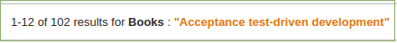
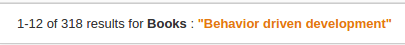
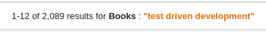
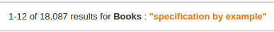
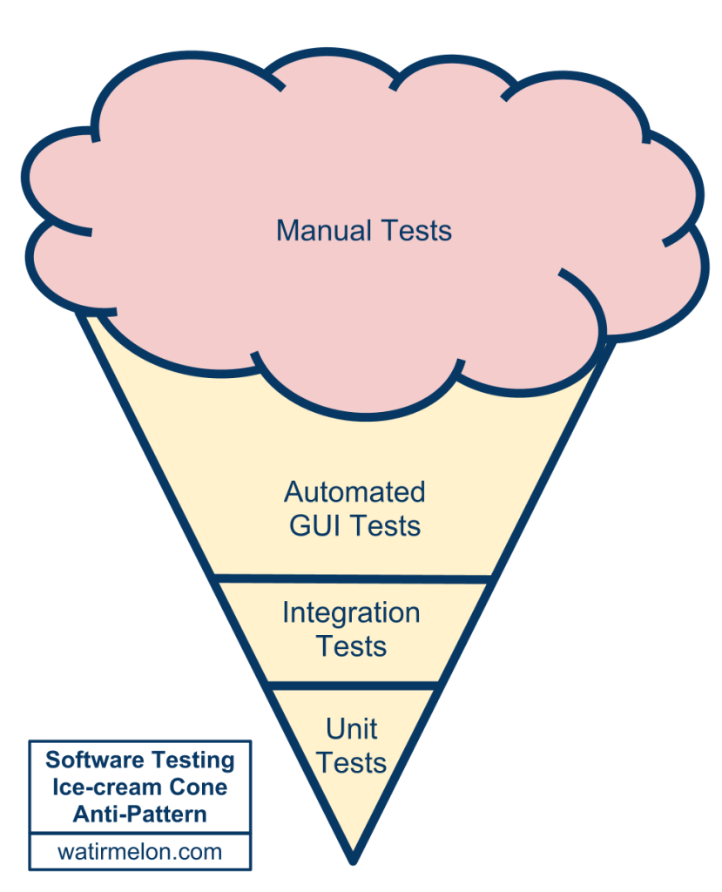

name: inverse
layout: true
class: center, middle, inverse
---
#Writing tests
###practical guidelines including
###patterns, anti-patterns and best practices
.footnote[@valorkin]

???

- Какая общая проблема у тестов и кода?
- У всех тестов, как и любого кода есть одна общая проблема: они написаны людьми.
- Что самое главное в написании тестов? Знание кода? Скилл? Паттерны?
- Какие цели мы преследуем и что нами движет при написании тестов.

---

---
## Common problem of tests and code?
--

## What do a most impact on tests quality?
???
- знание production кода
- скилы
- используемые паттерны
--

## Writing test goals?

---
##Finds problems early (regression)
--

##Safe refactor
--

##Documentation
--

##Design
---
#Yes, but NO

???
- Common problem of tests and code?
- What do a most impact on tests quality?
- Writing test goals?

---
#Humans

???
- Common problem of tests and code?
- What do a most impact on tests quality?
- Writing test goals?

---
##Any fool can write code that a computer can understand. 
##Good programmers write code that 
#*humans* 
##can understand. 

###Martin Fowler &copy;

???
- сделать нам жизнь проще
- в случае чего показать регрессию кода
- если тест упал, быстро понять где, почему и в каком контексте
- т.е. в целом экономить время и усилия
- сейчас посмотрим, как такие благородные цели 
- как лень... т.е. продуктивность можно зафакапить
- неправильной мотивацией
---
#Goals
???
Не поставив правильную цель,
нельзя получить ожидаемый результат
---





???
Об этом была написана пара книг и чуть больше статей и презентаций
---

##TDD

###Test Driven Development

???
- итак, в первую очередь
- TDD - замечательная идея, положившая начало культуре тестирования

---
# Development cycle

???
Цикл разработки
- Пишем тест, роняем его, пишем код, запускаем тесты, рефакторим и так по
кругу, пока не озеленим все тесты
- Почти у каждого из нас есть в команде человек, у которого знания о TDD на
этом заканчиваются

---
##BDD

###Behavior-driven development

???
- BDD привносит смысл и читабельность тестовых спецификаций
- Теперь мы тестируем не абстрактный код в вакууме, а элемент ("unit"),
наделённый законченной идеей.

---

#The .green-text[green] way

???

- Идея TDD в написании сначала failing теста, а потом кода, который пройдёт этот
тест, утрируют до следования "Зелёному пути".

- В итоге тесты написаны в отрыве от реальной жизни и общей концепции, не
связаны в test suits и больше напоминают свалку.

- Добавлять сюда новые тесты страшнее, чем рефакторить legacy code.

---

template: inverse
.h566[]

???

- Первое, что приходит в голову при виде подобных тестов - Кубик Рубика …
- И собирать его совсем не хочется.

---
#The Stranger


???

???
Чужак (The Stranger)

Кейс, который не относится к unit-тесту, в котором он расположен. Он на самом деле тестирует совершенно другой объект, чаще всего объект, который используется основным тестируемым объектом. Также известен как Дальний Родственник.

---
layout: false
.left-column[
  ## &nbsp;
  ### - the stranger
]
.right-column[
## Symptoms: The Stranger


.red[BAD]

```js
  describe('if user transfering money', function(){
    it('user should be logged in', function (){
      assert(request.user !== null,
        'err: user not logged in');
    });
  });
```

.green-text[GOOD]

```js
  describe('isAuthenticated', function(){
    describe('if user logged in', function (){
      it('should store user in request', function (){
        assert(request.user !== null,
          'err: user not logged in');
      });
    });
  });
```
]

???
Чужак (The Stranger)

Кейс, который не относится к unit-тесту, в котором он расположен. Он на самом деле тестирует совершенно другой объект, чаще всего объект, который используется основным тестируемым объектом. Также известен как Дальний Родственник.

---
.left-column[
  ## &nbsp;
  ### - the stranger
  ### - success against all odds
]
.right-column[
## Symptoms: Success Against All Odds

.red[BAD]

```js
  describe('isAdmin', function(){
    describe('if user logged in', function (){
      it('should store user in request', function (){
        assert(request.user !== null,
          'err: user not logged in');
      });
    });
  });
```

.green-text[GOOD]

```js
  describe('isAdmin', function(){
    describe('if user logged in', function (){
      ...
      it('should have have admin role', function (){
        assert(request.user.roles.contain('admin'),
          'err: user is not an admin');
      });
    });
  });
```
]

???
Успех Любой Ценой (Success Against All Odds)

Тест, который был написан для того, чтобы пройти успешно, а не для того, чтобы сначала провалиться (принцип fail first). Побочным эффектом является недостаточно глубокое тестирование и успешное прохождение там, где правильный тест должен упасть.

---
template: inverse
# Heap-sort

???

- что делать?
- Разбиваем на максимальное количество независимых Test кейсов.
- Группируем по смыслу

---
template: inverse
#Happy flows

???
- следующий этап эволюции the green way

---
template: inverse
.w748[]

???

- Как видит разработчик свой код
- Всё отлично, все тесты пройдены, код работает.
  Типичная ситуация: есть интеграция со сторонним сервисом. Тесты
  работают с моком этого сервиса, который всегда возвращает ожидаемый
  результат.
  Но как только мы получаем негативный или исключительный ответ, картина
  преобретает иной вид.

---
template: inverse
.h566[]

???

- Что мы имеем на самом деле
- Такая ситуация часто наблюдается в стартапах и на ранних стадиях
  проектов. В запущенных случаях она остается такой навсегда.
- нет валидации, нет обработки ошибок

Причины
- постоянная спешка
- нехватка времени

---
template: inverse
#The Mockery

---

layout: false
.left-column[
  ## &nbsp;
  ### - the mockery
]
.right-column[
## Symptoms: The Mockery


```js
describe('any', function(){
  it('should do something', function(){
    action.stub().return(some);
    getSome.mock().expect.to.be.calledOnce;
    getSome.mock().expect.to.be.calledWith(params);
    getSome.mock().stub().return(list);
    // etc..
  });  
});
```
]

???

Подделка (The Mockery)

Mocking можеть быть очень удобным и правильным. Но случается, что разработчики теряют чувство меры и используют его даже для тех частей системы, которые в принципе должны участвовать в тестировании. В этом случае unit-тест содержит так много mocks, заглушек (stubs) и фейков (fakes), что часть системы остается не протестированной.

---

layout: false
.left-column[
  ## &nbsp;
  ### - the mockery
  ### - the greedy catcher
]
.right-column[
## Symptoms: The Greedy Catcher


```js
describe('money transfer', function (){
  it('should throw err if receiver is not specified', function(){
    try{
      transferModey(user, null, -150);
    } catch (e){
      console.log('ups');
    }
  });
});
```
]

???

Жадный Ловец (The Greedy Catcher)

Тест, который ловит исключения и "проглатывает" их, либо заменяя на менее информативное сообщение, либо просто выводя ошибку на консоль, позволяя тесту успешно завершиться.

---

layout: false
.left-column[
  ## &nbsp;
  ### - the mockery
  ### - the greedy catcher
  ### - the sequencer
]
.right-column[
## Symptoms: The Sequencer


```js
function getFirstSocialFriends(){
  return [
    db.getFirstFacebookFriend(),
    db.getFirstGoglePlusFriend(),
    db.getFirstTwitterFriend()
  ];
}


describe('getting social first social friends', function(){
  it('should get first faceebook friend',  function (){
    var friends = getFirstSocialFriends();
    assert(isFacebookFriend(friends[0]);

    assert(_.any(friends, isFacebookFriend));
   });
});
```
]

???

Любитель Порядка (The Sequencer)

Тест, который зависит от того, что фактически неупорядоченные данные всегда появляются в одном и том же порядке.

---
template: inverse

## What can be done?

???

- Тесты должны проверять систему не только на положительных данных,
но и на негативных и исключительных.
- Могло быть и хуже

---

template: inverse
#No tests!?
--

##- No time
--

##- Code is to hard

--
##- We are evolving
---
template: inverse
#The Race

???

- Но не будем о грустном
- Нам повезло, мы собираем метрики, видим покрытие кода.
- И ставим цель: 100% покрытие кода тестами
---
template: inverse
.h566[]

???

- вся тима в экстазе
- каждый коммит приближает желанную цель
- 2 недели - 100% coverage достигнут
- все найденные баги пофикшены

---
template: inverse
# Going live

???

- 5 мин, логи красные от ошибок
- что могло пойти не так?
---
template: inverse


---
template: inverse
#Sh*t happens
  
---
template: inverse
## 100% covered

# 50% tested
---
template: inverse
#Good things first

---
template: inverse
#We have a tests!

???

- Не всё так плохо, как кажется. У нас 100% покрытие happy flows, branches and even more.
- Для интепретируемых языков, php\node.js, код застрахован от опечаток
- хорошая точка отсчёта

---
template: inverse
# The Liar


???

Лжец (The Liar)

Unit-тест, который успешно выполняет все кейсы и выглядит работающим правильно, однако при более детальном рассмотрении обнаруживается, что он на самом деле не тестирует то, что должен.

---
layout: false
.left-column[
  ## &nbsp;
  ### - the liar
]
.right-column[
## Symptoms: The Liar


```js
describe('transfer money', function (){
  it('should withdraw money', function(){
    receiver.deposit(amount);

    receiver.deposit.should.be.called;

    // or
    assert(user.balance ===
      user_before_deposit.balance + amount);
  });
});
```
]

???

Лжец (The Liar)

Unit-тест, который успешно выполняет все кейсы и выглядит работающим правильно, однако при более детальном рассмотрении обнаруживается, что он на самом деле не тестирует то, что должен.

---
template:inverse
.w748[]

???

Инспектор (The Inspector)

Unit-тест, который нарушает инкапсуляцию в попытке достичь 100% покрытия кода (code coverage) и при этом знает слишком много о тестируемой системе. При рефакторинге системы такой тест слишком часто ломается и требует исправлений.

---
layout: false
.left-column[
  ## &nbsp;
  ### - the liar
  ### - the inspector
]
.right-column[
## Symptoms: The Inspector


```js
function transferMoney(emiter, receiver, amount){
  emiter.withdraw(amount);
  receiver.deposit(amount);
}

describe('transfering money', function (){
  it('should deposit money', function(){
    transferMoney(emiter, receiver, amount);

    assert(emiter.balance === 
      (emiter_before_transfer.balance - balance));
  });
});
```]

???

Инспектор (The Inspector)

Unit-тест, который нарушает инкапсуляцию в попытке достичь 100% покрытия кода (code coverage) и при этом знает слишком много о тестируемой системе. При рефакторинге системы такой тест слишком часто ломается и требует исправлений.

---
template: inverse
# Full speed ahead!!!
---
template: inverse

???
Сейчас я буду всё тестировать

---
layout: false
.left-column[
  ## &nbsp;
  ### - excessive setup
]

.right-column[
## Symptoms: Excessive Setup


```js
describe('rocket', function (){
  beforeEach(function(){ //setup
    gatherScientists();
    buildRocketPlan();
    gatherEngineers();
    buildRocketParts();
    gatherRocket();
  });

  it('should be a rocket', function (){
    assert(isRocket(rocket));
  });
});
```
]

???

Чрезмерная Инициализация (Excessive Setup)

Тест, который требует тяжелой работы по инициализации прежде чем начать собственно тестирование. Иногда случается видеть как сотни строк вызываются для одного единственного теста, создавая при этом множество объектов. Из-за этого «шума» сложно удостовериться что именно тестируется.

---
layout: false
.left-column[
  ## &nbsp;
  ### - excessive setup
  ### - giant
]

.right-column[
## Symptoms: Giant


```js
describe('rocket', function (){
  before(function(){ //setup
    gatherScientists();
    ...
    gatherRocket();
  });

  it('should be a rocket', function (){
    assert(isRocket(rocket));
  });
  it('should have engine', ...);
  it('should have jet', ...);
  it('should have pilot', ...);
});
```
]

???

Гигант (Giant)

Unit-тест, который хотя и правильно тестирует приложение, но растекается на тысячи строк кода и содержит слишком много кейсов. Это может служить признаком того, что тестируемая система представляет из себя антипаттерн Всемогущий Объект (God Object).

---
layout: false
.left-column[
  ## &nbsp;
  ### - excessive setup
  ### - giant
  ### - the nitpicker
]

.right-column[
## Symptoms: The Nitpicker


```js
describe('transfer money route', function (){
// here should be a code sample
});
```
]

???

Крохобор (The Nitpicker)

Unit-тест, который проверяет весь результат работы, в то время как на самом деле важна только его малая часть. В результате приходится часто обновлять тест, чтобы отражать изменения в незначительных вещах. Типичен при тестировании веб-приложений.

---
layout: false
.left-column[
  ## &nbsp;
  ### - excessive setup
  ### - giant
  ### - the nitpicker
  ### - the dodger
]

.right-column[
## Symptoms: The Dodger


```js
function depositMoney(receiver, amount){
  receiver.deposit(amount);
}

describe('deposit money', function (){
  it('should deposit money', function(){
    var receiver = new User();

    depositMoney(receiver, amount);

    assert(isUser(receiver));
  });
});
```
]

???

Уклонист(The Dodger)

Unit-тест, который тестирует множество второстепенных (и, как правило, простых) мелочей, но не тестирует основное поведение.

---

template: inverse
# The One


???

Избранный (The One)

Комбинация нескольких анти-паттернов, в особенности «Зайца» и Гиганта. Такой unit-тест состоит из единственного метода, который тестирует всю функциональность объета. Типичным индикатором проблемы являтся название тестового метода по названию unit-теста и большое количество строк инициализации и assert-ов.

---
layout: false
.left-column[
  ## &nbsp;
  ### - excessive setup
  ### - giant
  ### - the nitpicker
  ### - the dodger
  ### - the one
]

.right-column[
## Symptoms: The One


```js
describe('user.js', function(){
  it('getUser', function (){
    ...
    // test all the stuff
    assert(...);
    assert(...);
    assert(...);
    ....
  });
});
```
]

???

Избранный (The One)

Комбинация нескольких анти-паттернов, в особенности «Зайца» и Гиганта. Такой unit-тест состоит из единственного метода, который тестирует всю функциональность объета. Типичным индикатором проблемы являтся название тестового метода по названию unit-теста и большое количество строк инициализации и assert-ов.

---

template: inverse
#It has to be done!

---
template: inverse
#The free ride


???

Заяц (The Free Ride)

Вместо того, чтобы написать новый кейс-метод, просто добавляется новый assert к существующему кейсу.

---
layout: false
.left-column[
  ## &nbsp;
  ### - the free ride
]

.right-column[
## Symptoms: The Free Ride


```js
describe('...', function(){
  it('...', function(){
    ...
    // new assert, usually not connected to current test cases
    assert(...); 
  });
});
```
]

???
Заяц (The Free Ride)

Вместо того, чтобы написать новый кейс-метод, просто добавляется новый assert к существующему кейсу.

---

layout: false
.left-column[
  ## &nbsp;
  ### - the free ride
  ### - the enumerator
]

.right-column[
## Symptoms: The Enumerator


```js
describe('module 1', function(){
  it('test1', ...);
  it('test2', ...);
  it('test3', ...);
});
```
]

???
Счётчик (The Enumerator)

Unit-тест, в котором все кейсы плохо именованы (например, test1, test2, test3). В результате назначение тест-кейса неясно и единственный способ понять, что сломалось - лезть в код теста и молиться, чтобы он оказался понятным.

---
template: inverse
#The ice-cream cone
.h566[]
???
ну и наиболее распространённая ситуация
---
template: inverse
#Common anti-patterns

---

layout: false
.left-column[
  ## &nbsp;
  ### - generous leftovers
]

.right-column[
## Symptoms: Generous Leftovers


```js
describe('users service', function(){
  var _users = [];
  it('should get users', function (){
    ...
    _users = userService.getUsers();
    ...
  });

  it('user list should be sorted', function(){
    ...
    assert(isSirted(_users));
  });
});
```
]

???
Щедрые остатки (Generous Leftovers)

Случай, когда один unit-тест создаёт данные, которые где-то сохраняются, а другой тест их потом переиспользует. Если "генератор данных" будет по какой-то причине вызван позже или пропущен, то тест, использующий его данные, не пройдёт.

---

layout: false
.left-column[
  ## &nbsp;
  ### - generous leftovers
  ### - the secret catcher
]

.right-column[
## Symptoms: The Secret Catcher


```js
describe('money transfer', function(){
  it('should be fine', function(){
    callToFunctionWhichShouldNotThrow();
  });
});
```
]

???

Тайный Ловец (The Secret Catcher)

Тест, который на первый взгляд не делает никакого тестирования из-за отсутствия assertions, но на самом деле дёргает за ниточки системы и полагается на выбрасывание какого-то исключения в случае проблем. Ожидается, что тестовое окружение поймает эту ошибку и отобразит тест как проваленный.

---

layout: false
.left-column[
  ## &nbsp;
  ### - generous leftovers
  ### - the secret catcher
  ### - the loudmouth
]

.right-column[
## Symptoms: The Loudmouth


```js
describe('money transfer', function(){
  it('should transfer money', function (){
    ...
    console.log('money was successfully transfered');
    ...
  });
});

```
]

???

Крикун (The Loudmouth)

Unit-тест, который забивает консоль множеством диагностических сообщений, логов и другой информацией, даже если тест проходит успешно. Иногда является результатом ненужного кода, который не был удалён после отладки теста.

---
template: inverse
#The Slow Poke


???

Тормоз (The Slow Poke)

Unit-тест, который выполняется крайне медленно. Когда разработчик запускает его, то у него появляется достаточно времени, чтобы сходить в туалет или покурить. Или, что может быть ещё хуже, он не станет дожидаться завершения тестирования перед тем, как вечером закоммититься и пойти домой.

---

layout: false
.left-column[
  ## &nbsp;
  ### - generous leftovers
  ### - the secret catcher
  ### - the loudmouth
  ### - the slow poke
]

.right-column[
## Symptoms: The Slow Poke


```js
describe('social integration', function(){
  it('get Snoop Dogg facebook friends', function(){
    // mocks are evel
    var friends = social.getAllFacebookFriends();
  });
});
```
]

???

Тормоз (The Slow Poke)

Unit-тест, который выполняется крайне медленно. Когда разработчик запускает его, то у него появляется достаточно времени, чтобы сходить в туалет или покурить. Или, что может быть ещё хуже, он не станет дожидаться завершения тестирования перед тем, как вечером закоммититься и пойти домой.

---
template: inverse
## Anal probe
.w748[]
---
template: inverse
#Brittle tests

???
хрупкие тесты

---

layout: false
.left-column[
  ## &nbsp;
  ### - the local hero
]

.right-column[
## Symptoms: The Local Hero


```js
describe('files reader', function(){
  it('should use correct path separator', function(){
    assert(process.environment.path.separator === '\');
  });
});
```
]

???

Местный Герой (The Local Hero)

Тест, который зависит от чего-то специфичного для данного окружения. В результате тест успешно проходит у конкретного разработчика, но не выполняется у других.

---

layout: false
.left-column[
  ## &nbsp;
  ### - the local hero
  ### - hidden dependency
]

.right-column[
## Symptoms: Hidden Dependency


```js
function doSomeActionDepandantOnDefaults(){
  var default = getSystemDefaults();
}

describe('money transfer', function(){
  it('should deposit money', function(){
    
    ...
    doSomeActionDepandantOnDefaults();
    ...
    assert(...);
  });
});
```
]

???

Скрытая Зависимость (Hidden Dependency)

Близкий родственник Местного Героя. Это unit-тест, который требует, чтобы перед запуском были заполнены какие-то данные. Если эти данные отсутствуют, то тест падает, оставляя мало информации о причине проблемы и заставляя разработчика копаться в груде кода для того, чтобы определить какие данные и откуда должны были взяться.

---

layout: false
.left-column[
  ## &nbsp;
  ### - the local hero
  ### - hidden dependency
  ### - the peeping tom
]

.right-column[
## Symptoms: The Peeping Tom


```js
describe('users service', function(){
  var _users = [];
  it('should get users', function (){
    ...
    _users = userService.getUsers();
    ...
  });

  it('user list should be sorted', function(){
    ...
    assert(isSirted(_users));
  });
});
```
]

???

Подглядыватель (The Peeping Tom)

Тест, который из-за общих ресурсов может видеть данные других тестов и может упасть, даже если тестируемая система полностью валидна. Типичным примером может служить использование статических полей для хранения коллекций. Если они не очищаются должным образом, то возможны неожиданные побочные эффекты в других тестах. Также известен как анти-паттерн Незваные Гости.

---
template: inverse
#Development style
---
layout: false
.left-column[
  ## &nbsp;
  ### - KISS
]

.right-column[
##&nbsp;
##- Keep it simple stupid
]

???

---
layout: false
.left-column[
  ## &nbsp;
  ### - KISS
  ### - YAGNI
]

.right-column[
##&nbsp;
###- Keep it simple stupid
##- You aren't gonna need it
]
???

---
layout: false
.left-column[
  ## &nbsp;
  ### - KISS
  ### - YAGNI
  ### - fake it
]

.right-column[
##&nbsp;
###- Keep it simple stupid
###- You aren't gonna need it
##- Fake it till you make it
]
???

---
layout: false
.left-column[
  ## &nbsp;
  ### - KISS
  ### - YAGNI
  ### - fake it
  ### - make it
]

.right-column[
##&nbsp;
###- Keep it simple stupid
###- You aren't gonna need it
###- Fake it till you make it
##- Make it works then make it pretty
]
???

---
template: inverse
#Always test your program with normal, boundary and extreme data sets.

---
template: inverse
# Unit test patterns

---
layout: false
.left-column[
  ## &nbsp;
  ### - state based
]

.right-column[
## State-based tests Pattern


```js
describe('calc', function (){
  it('should sum two numbers', function(){
    // arrange
    var calc = new Calc();
    var a = 2, b = 3;
    var expectedSum = 5;
    // act
    var sum = calc.sum(a, b);

    //assert
    assert.equal(sum, expectedSum);
  });
});
```
]

???

Test code result exposed in code state change
- Values directly returned from the method
- Values exposed through the object fields
- Values exposed through other methods or properties of the object
- Values that come from outside the object, for example static state or a shared data structure.

Pros: fast, low coupled, readability
---
layout: false
.left-column[
  ## &nbsp;
  ### - state based
  ### - interaction based
]

.right-column[
## Interaction-based tests Pattern


```js
function transferMoney(){
  deposit();
  log.append('deposit to user successful');
  ...
}

deposit('money transfer', function (){
  it('should log action result states', function() {
    // extract dependency
    // add spy or stub a function
    // setup expectations
    log.append.should.be.calledWith(/deposit.*successful/ig);
  });
});
```
]

???

If tested methods do not expose results directly (logs, transactions)
- tested logic calls methods on other dependencies
- check: method got called
- check: passed arguments
 
cons: 
- require knowledge about internals
- less robust

---
layout: false
.left-column[
  ## &nbsp;
  ### - state based
  ### - interaction based
  ### - exception testing
]

.right-column[
## Exception Testing Pattern


```js
describe('transfer money', function(){
  it('should throw an exception if amount is not a number', 
    function(){
      assert.throws(transferMoney(emiter, receiver, 'monkey'),
        ValueValidationException);
  });
});
```
]

???

Throwing exceptions is a part of app life loop?

At least exceptions handling

---
layout: false
.left-column[
  ## &nbsp;
  ### - state based
  ### - interaction based
  ### - exception testing
  ### - algorithm testing
]

.right-column[
## Algorithm Testing Pattern

### You can brake a rules a bit to test most valuable logic
]

???

Is all about math or internal logic
---
template: inverse
#Tests structure

---
layout: false
.left-column[
  ## &nbsp;
  ### 1. Arrange
]

.right-column[
## Test case structure

###**Arrange**: setup everything needed for the running the tested code. This includes any initialization of dependencies, mocks and data needed for the test to run
]
???
- **Arrange**: setup everything needed for the running the tested code. This includes any initialization of dependencies, mocks and data needed for the test to run
---
layout: false
.left-column[
  ## &nbsp;
  ### 1. Arrange
  ### 2. Act
]

.right-column[
## Test case structure

**Arrange**: setup everything needed for the running the tested code. This includes any initialization of dependencies, mocks and data needed for the test to run.

### **Act**: Invoke the code under test.
]
???
- Invoke the code under test.
---

layout: false
.left-column[
  ## &nbsp;
  ### 1. Arrange
  ### 2. Act
  ### 3. Assert
]

.right-column[
## Test case structure

**Arrange**: setup everything needed for the running the tested code. This includes any initialization of dependencies, mocks and data needed for the test to run.

**Act**: Invoke the code under test.

### **Assert**: Specify the pass criteria for the test, which fails it if not met.
]
???
- **Assert**: Specify the pass criteria for the test, which fails it if not met.
---

layout: false
.left-column[
  ## &nbsp;
  ### 1. Arrange
  ### 2. Act
  ### 3. Assert
  ### Sample
]

.right-column[
## Test case structure

```js
describe('money transger', function(){
  it('should transfer money', function(){
    // Arrange
    var receiver = new User({name: 'Scoot'});
    var emiter = new User({name: 'Robert'});
    var amount = 100500;

    // Act
    transferMoney(emiter, receiver, amount);

    //Assert
    doWithdraw.should.be.calledWith(emiter, amount);
    doDeposit.should.be.calledWith(receiver, amount);
  });  
});
```
]
???
---

layout: false
.left-column[
  ## &nbsp;
  ### 1. Setup
  ### 2. Execution
  ### 3. Validation
  ### 4. Cleanup
]

.right-column[
## Test suite structure

```js
describe('money transger', function(){
  before(function (){
      // setup context
  });

  after(function(){
    // cleanup context
  });

  it('should transfer money', function(){
    // Arrange === Setup call params, fakes, etc.
    var receiver = new User({name: 'Scoot'});
    var emiter = new User({name: 'Robert'});
    var amount = 100500;

    // Act === Execute
    transferMoney(emiter, receiver, amount);

    //Assert === Validate
    doWithdraw.should.be.calledWith(emiter, amount);
    doDeposit.should.be.calledWith(receiver, amount);
  });  
});
```
]
???
- всё тоже самое, но setup\clean подготавливают контекст данных
- конфигурируют среду выполнения тестируемого метода
---
template:inverse
#A few simple rules to follow
---

layout: false
.left-column[
  ### - behaviour slicing
]

.right-column[
##- Keep test cases focused, one unit test per behaviour
]

???
- Keep test cases focused, one unit test per behaviour
---

layout: false
.left-column[
  ###- behaviour slicing
  ###- builder 
]

.right-column[
###- Keep test cases focused, one unit test per behaviour
##- Use builder pattern to Arrange and CleanUp
```js
var user = UserBuilder.create().withName('Scoot');
```
]
???
- Use builder pattern to Arrange and CleanUp

---

layout: false
.left-column[
  ###- behaviour slicing
  ###- builder
  ###- extract simulators 
]

.right-column[
###- Keep test cases focused, one unit test per behaviour
###- Use builder pattern to Arrange and CleanUp
##- Extract and aggregate stubs into simulators, and **test** them
]

???
- Extract and aggregate stubs into simulators, and **test** them

---
template: inverse
#80/20
???
- Test code important like production code
---

layout: false
.left-column[
  ###- behaviour slicing
  ###- builder
  ###- extract simulators 
  ###- risk based testing
  ###- test code matter
]

.right-column[
###- Keep test cases focused, one unit test per behaviour
###- Use builder pattern to Arrange and CleanUp
###- Extract and aggregate stubs into simulators, and **test** them
###- Test only what is important
##- Test code important like production code
]

???
- Test code important like production code

---

layout: false
.left-column[
  ###- behaviour slicing
  ###- builder
  ###- extract simulators 
  ###- risk based testing
  ###- test code matter
  ###- reviews
]

.right-column[
###- Keep test cases focused, one unit test per behaviour
###- Use builder pattern to Arrange and CleanUp
###- Extract and aggregate stubs into simulators, and **test** them
###- Test only what is important
###- Test code important like production code
##- Review your test code
]

---
template: inverse

???
ну а если вы не ревьювите production code, ну ж ладно
---

template: inverse
# F.I.R.S.T

???

- fast
- isolated
- repeatable
- self-verifying
- timely

---
layout: false
.left-column[
  ## &nbsp;
  ### - fast
]

.right-column[
## F.I.R.S.T
###- **F**ast - tests should be able to be executed often
]

???
- **F**ast - tests should be able to be executed often

---
layout: false
.left-column[
  ## &nbsp;
  ### - fast
  ### - isolated
]

.right-column[
## F.I.R.S.T
- **F**ast - tests should be able to be executed often
###- **I**solated - tests on their own cannot depend on external factors or on the result of another test
]

???
- **I**solated - tests on their own cannot depend on external factors or on the result of another test

---
layout: false
.left-column[
  ## &nbsp;
  ### - fast
  ### - isolated
  ### - repeatable
]

.right-column[
## F.I.R.S.T
- **F**ast - tests should be able to be executed often
- **I**solated - tests on their own cannot depend on external factors or on the result of another test
###- **R**epeatable - tests should have the same result every time we run them.
]

???
- **R**epeatable - tests should have the same result every time we run them.
---
layout: false
.left-column[
  ## &nbsp;
  ### - fast
  ### - isolated
  ### - repeatable
  ### - self-verifying
]

.right-column[
## F.I.R.S.T
- **F**ast - tests should be able to be executed often
- **I**solated - tests on their own cannot depend on external factors or on the result of another test
- **R**epeatable - tests should have the same result every time we run them
###- **S**elf-verifying - tests should include assertions; no human intervention needed
]

???
- **S**elf-verifying - tests should include assertions; no human intervention needed

---

layout: false
.left-column[
  ## &nbsp;
  ### - fast
  ### - isolated
  ### - repeatable
  ### - self-verifying
  ### - timely
]

.right-column[
## F.I.R.S.T
- **F**ast - tests should be able to be executed often
- **I**solated - tests on their own cannot depend on external factors or on the result of another test
- **R**epeatable - tests should have the same result every time we run them
- **S**elf-verifying - tests should include assertions; no human intervention needed
###- **T**imely - tests should be written along with the production code
]

???
- **T**imely - tests should be written along with the production code

---
template: inverse
# Questions?

---
template: inverse
# Thank you
.footnote[
[@valorkin](https://twitter.com/valorkin)

[valorkin@gmail.com](https://twitter.com/valorkin)
]
