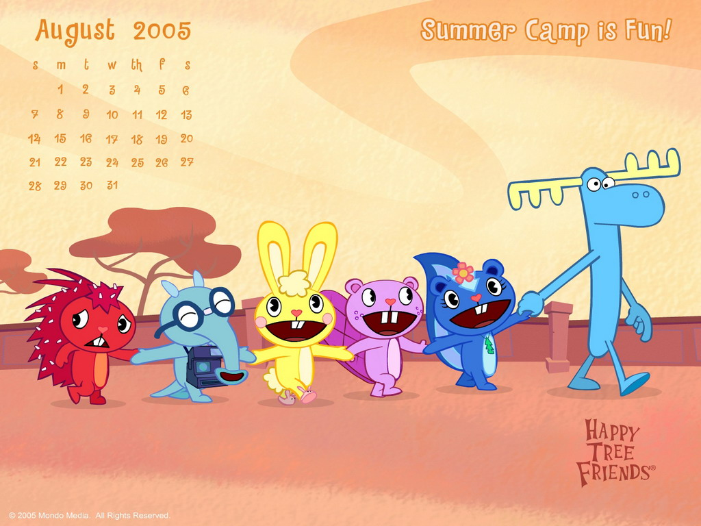

name: inverse
layout: true
class: center, middle, inverse
page: 1
---
#Writing tests

practical guidelines including

patterns, anti-patterns and best practices
.footnote[@valorkin]
???
- У всех тестов, как и любого когда есть одна общая проблема: они написаны людьми.
- Какие цели мы преследнуем и что нами движет при написании тестов.

---
##TDD

Test Driven Development

???
- итак, в первую очередь
- TDD – замечательная идея, положившая начало культуре тестирования

---
# Development cycle

???
- Пишем тест, роняем его, пишем код, запускаем тесты, рефакторим и так по
кругу, пока не озеленим все тесты
- Почти у каждого из нас есть в команде человек, у которого знания о TDD на
этом заканчиваются

---
## BDD

Behavior-driven development

???
- BDD привносит смысл и читабельность тестовых спецификаций
- Теперь мы тестируем не абстрактную функцию в вакууме, а элемент ("unit"),
наделённый законченной идеей.

---
#The .green-text[green] way

???

- Идея TDD в написании сначала failing теста, а после кода, который пройдёт этот
тест, утрируется до следования « Зелёному пути».

- В итоге тесты написаны в отрыве от реальной жизни и общей концепции, не
связаны в test suits и больше напоминают свалку.

- Добавлять сюда новые тесты страшнее, чем рефакторить legacy code.

---


???

- Первое, что приходит в голову при виде подобных тестов – Кубик Рубика…
- И собирать его совсем не хочется.

---

#Heapsort

???

- что делать?
- Разбиваем на максимальное количество независимых Test кейсов.
- Группируем по смыслу

---
layout: false
.left-column[
  ## &nbsp;
  ### - the stranger
]
.right-column[
## Symptoms: The Stranger


```js
// here will be sample
```
]

???

Кейс, который не относится к unit-тесту, в котором он расположен. Он на самом деле тестирует совершенно другой объект, чаще всего объект, который используется основным тестируемым объектом. Также известен как Дальний Родственник.

---
.left-column[
  ## &nbsp;
  ### - the stranger
  ### - success against all odds
]
.right-column[
## Symptoms: Success Against All Odds

```js
// here will be sample
```
]

???

Тест, который был написан для того, чтобы пройти успешно, а не для того, чтобы сначала провалиться (принцип fail first). Побочным эффектом является недостаточно глубокое тестирование и успешное прохождение там, где правильный тест должен упасть.

---
template: inverse
#Happy flow

???
- следующий этап эволюции the green way

---
template: inverse
.w748[]

???

- Как видит разработчик свой код
- Всё отлично, все тесты пройдены, код работает.
  Типичная ситуация: есть интеграция со сторонним сервисом. Тесты
  работают с моком этого сервиса, который всегда возвращает ожидаемый
  результат.
  Но как только мы получаем негативный или исключительный ответ, картина
  преобретает иной вид.

---
template: inverse
.w748[]

???

- Что мы имеем на самом деле
- Такая ситуация часто наблюдается в стартапах и на ранних стадиях
  проектов. В запущенных случаях она остается такой навсегда.

Причины
- постоянная спешка
- нехватка времени

---
layout: false
.left-column[
  ## &nbsp;
  ### - no validation
]
.right-column[
## Symptoms: No Validation


```js
// here will be sample
```
]

---
layout: false
.left-column[
  ## &nbsp;
  ### - no validation
  ### - no error handlers
]
.right-column[
## Symptoms: No Error Handlers


```js
// here will be sample
```
]

---
template: inverse

## What can be done?

???

Тесты должны проверять систему не только на положительных данных,
но и на негативных и исключительных.

---
template: inverse
#The Race

???

- Нам повезло, мы собираем метрики, видим покрытие кода.
- И ставим цель: 100% покрытие кода тестами
---
template: inverse
.w748[]

???

- вся тима в экстазе, каждый коммит приближает желанную цель
- каждый коммит приблежает желанную цель
- 2 недели - 100% coverage достигнут
- все найденные баги пофикшены

---
template: inverse
# Going live

???

- 5 мин, логи красные от ошибок
- что могло пойти не так?
---
template: inverse
#Sh*t happens

---
template: inverse
#Good things first

---
template: inverse
#We have a tests!

???

- Не всё так плохо, как кажется. У нас 100% покрытие happy flows, branches and even more.
- Для интепретируемых языков, php\node.js, код застрахован от опечаток
- хорошая точка отсчёта

---
layout: false
.left-column[
  ## &nbsp;
  ### - the liar
]
.right-column[
## Symptoms: The Liar


```js
// here will be sample
```
]

???

Unit-тест, который успешно выполняет все кейсы и выглядит работающим правильно, однако при более детальном рассмотрении обнаруживается, что он на самом деле не тестирует то, что должен.

---
layout: false
.left-column[
  ## &nbsp;
  ### - the liar
  ### - the inspector
]
.right-column[
## Symptoms: The Inspector


```js
// here will be sample
```
]

???

Unit-тест, который нарушает инкапсуляцию в попытке достичь 100% покрытия кода (code coverage) и при этом знает слишком много о тестируемой системе. При рефакторинге системы такой тест слишком часто ломается и требует исправлений.

---
template: inverse
#No tests!?
--

## - No time
--

##- Code is to hard

---
template: inverse
# Full ahead!!!

???
Сейчас я буду всё тестировать

---
layout: false
.left-column[
  ## &nbsp;
  ### - excessive setup
]

.right-column[
## Symptoms: Excessive Setup


```js
// here will be sample
```
]

???

- Тест, который требует тяжелой работы по инициализации прежде чем начать собственно тестирование. Иногда случается видеть как сотни строк вызываются для одного единственного теста, создавая при этом множество объектов. Из-за этого «шума» сложно удостовериться что именно тестируется.

---
layout: false
.left-column[
  ## &nbsp;
  ### - excessive setup
  ### - giant
]

.right-column[
## Symptoms: Giant


```js
// here will be sample
```
]

???

Unit-тест, который хотя и правильно тестирует приложение, но растекается на тысячи строк кода и содержит слишком много кейсов. Это может служить признаком того, что тестируемая система представляет из себя антипаттерн Всемогущий Объект (God Object).

---
layout: false
.left-column[
  ## &nbsp;
  ### - excessive setup
  ### - giant
  ### - the nitpicker
]

.right-column[
## Symptoms: The Nitpicker


```js
// here will be sample
```
]

???

Unit-тест, который проверяет весь результат работы, в то время как на самом деле важна только его малая часть. В результате приходится часто обновлять тест, чтобы отражать изменения в незначительных вещах. Типичен при тестировании веб-приложений.

---
layout: false
.left-column[
  ## &nbsp;
  ### - excessive setup
  ### - giant
  ### - the nitpicker
  ### - the dodger
]

.right-column[
## Symptoms: The Dodger


```js
// here will be sample
```
]

???

Unit-тест, который тестирует множество второстепенных (и, как правило, простых) мелочей, но не тестирует основное поведение.

---
layout: false
.left-column[
  ## &nbsp;
  ### - excessive setup
  ### - giant
  ### - the nitpicker
  ### - the dodger
  ### - the free ride
]

.right-column[
## Symptoms: The Free Ride


```js
// here will be sample
```
]

???

Вместо того, чтобы написать новый кейс-метод, просто добавляется новый assert к существующему кейсу.

---
layout: false
.left-column[
  ## &nbsp;
  ### - excessive setup
  ### - giant
  ### - the nitpicker
  ### - the dodger
  ### - the free ride
  ### - the one
]

.right-column[
## Symptoms: The One


```js
// here will be sample
```
]

???

Комбинация нескольких анти-паттернов, в особенности «Зайца» и Гиганта. Такой unit-тест состоит из единственного метода, который тестирует всю функциональность объета. Типичным индикатором проблемы являтся название тестового метода по названию unit-теста и большое количество строк инициализации и assert-ов.

---

